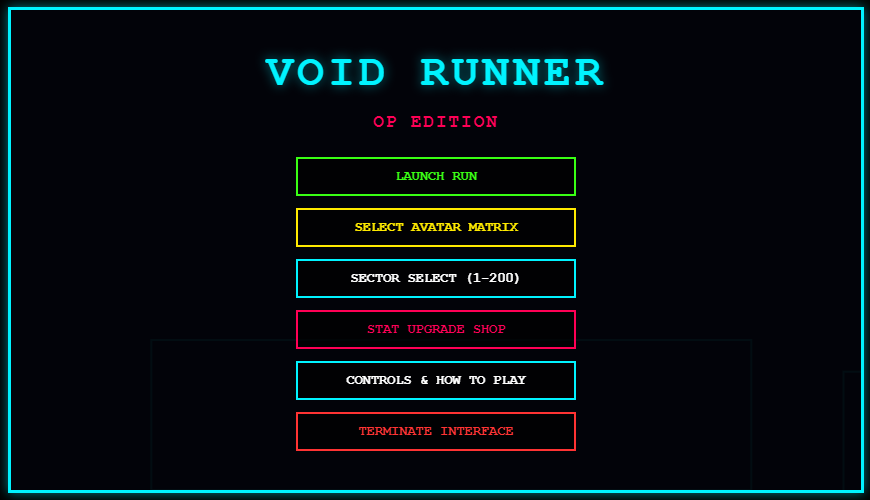
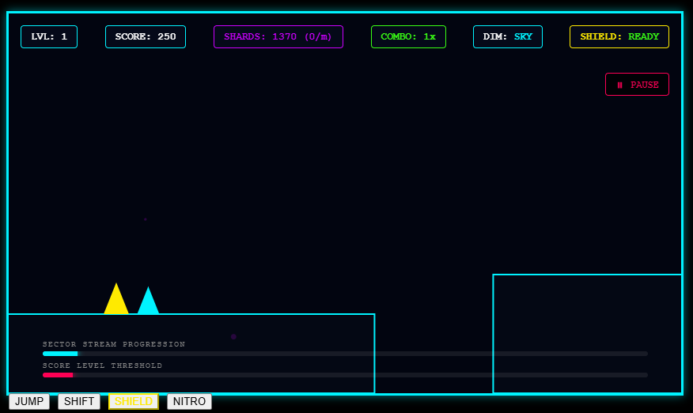

# 🌌 MT Void Runner

[](https://mtvoidrunner.vercel.app/)
[](https://github.com/mtevan/MT-Void-Runner-)

### A Deep-Space Runner Challenge

**MT Void Runner** is an immersive, fast-paced web-based arcade game where players navigate a cosmic vessel or avatar through an endless, hazard-filled void. Avoid deep-space obstacles, pick up cosmic shards, and test your reflexes to see how long you can survive the endless abyss.

🚀 **[Play MT Void Runner Now!](https://mtvoidrunner.vercel.app/)**

---

## 🎮 Gameplay Preview

### Main Menu and Sector Selection
Before launching, players can configure their runner, upgrade stats, and select a starting sector. The menu system handles over 200 sectors of increasing difficulty.

|  |
|:--:|
| *MT Void Runner Main Interface (OP Edition)* |

### In-Game Interface
Once in the void, the player must dodge oncoming geometry hazards. The user interface tracks crucial run data like score level thresholds, sector stream progression, and ability readiness.

|  |
|:--:|
| *In-Game Interface & HUD* |

---

## 🕹️ Controls & HUD Guide

Referencing the in-game mechanics and UI indicators:

### Key Action Inputs

| Input | Description |
| :--- | :--- |
| **SHIFT** | Standard Dash / Modifier. |
| **SHIELD** | Activates defensive barrier (Track status via the `SHIELD: READY` UI indicator). |
| **NITRO** | Trigger a high-speed engine burst. |

---

## 🛠️ Tech Stack

This project is built from scratch entirely with vanilla web technologies for lightning-fast performance and zero build dependencies:

- **Markup:** HTML5
- **Styling:** CSS3 (Custom responsive layouts & mobile enhancements)
- **Logic & Engine:** Vanilla JavaScript (`game.js` utilizing Canvas / Web APIs)
- **Deployment:** [Vercel](https://vercel.com)

---

## 🚀 Running Locally

Because this project is a zero-dependency static site, running it locally is incredibly simple. No installation required!

### Method 1: Just Double-Click
1. **Clone the repository:**
   ```bash
   git clone [https://github.com/mtevan/MT-Void-Runner-.git](https://github.com/mtevan/MT-Void-Runner-.git)
   cd MT-Void-Runner-
